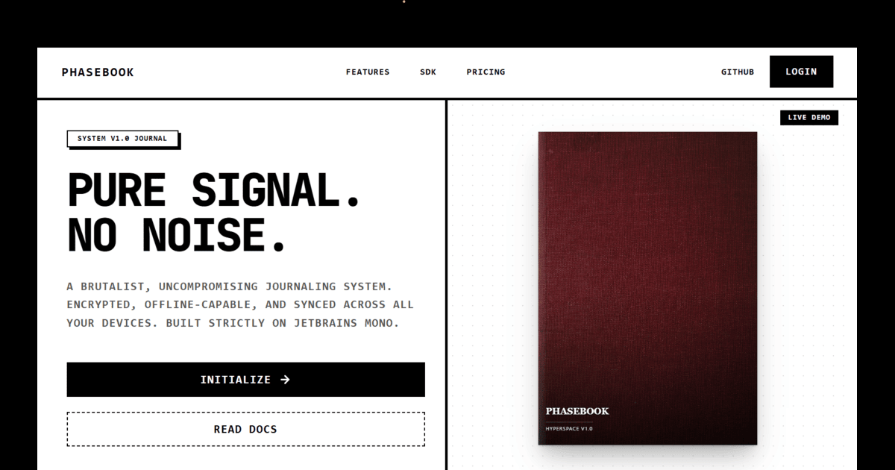

# Phasebook 📓

> A brutalist, uncompromising journaling system built for developers. 

Phasebook is a high-performance, edge-synced journaling platform featuring a custom 60FPS WebGL-style CSS 3D interactive book engine. It is built strictly on JetBrains Mono, embracing a brutalist design philosophy that removes all noise and focuses purely on signal.



## 🏗️ Architecture (Monorepo)

This repository is structured as a TypeScript monorepo containing three core pillars:

- **`/web`**: The Next.js frontend application (Dashboard, Interactive Archive, SDK Documentation).
- **`/backend`**: A serverless edge API built with Hono, deployed on Cloudflare Workers.
- **`/packages/phasebook`**: The standalone 3D interactive book engine (published to NPM as `phasebook`).

*(Note: The native Android application is hosted in a separate repository to maintain ecosystem compatibility).*

## ✨ Key Features

- **Hardware Accelerated 3D**: The core Phasebook engine uses advanced CSS `preserve-3d` transforms to deliver perfectly smooth, realistic page turns on both mobile and desktop.
- **Edge Synced**: The backend runs on Cloudflare Workers and a D1 (Serverless SQLite) database, guaranteeing zero-latency global syncing.
- **SDK & API Keys**: Users can generate highly secure API keys from their dashboard to fetch and embed their public journal entries into any external React application using the Phasebook SDK.
- **Brutalist Aesthetic**: Zero curves. Zero gradients. Hard shadows. Built exclusively with Tailwind CSS.
- **Dark Mode Ready**: Fully supports system-level Light/Dark mode toggling.

## 🛠️ Tech Stack

**Frontend:**
- Next.js (App Router)
- React 19
- Tailwind CSS v4
- Framer Motion

**Backend:**
- Cloudflare Workers
- Cloudflare D1 (Database)
- Hono (Routing Framework)
- Upstash Redis (Caching Layer)

## 🚀 Quick Start

### 1. Start the Backend
Navigate to the backend directory, install dependencies, and start the local Wrangler development server:
```bash
cd backend
npm install
npx wrangler dev
```

### 2. Start the Frontend
In a new terminal window, navigate to the web directory and start the Next.js development server:
```bash
cd web
npm install
npm run dev
```

### Environment Variables
For local development, ensure you have a `.env.local` file in the `web/` directory:
```env
NEXT_PUBLIC_API_URL=http://127.0.0.1:8787/api
```

## 📦 The SDK Package

The core 3D book engine is available as a public NPM package. You can install it in any React project:
```bash
npm install phasebook framer-motion lucide-react
```
For detailed usage instructions, view the [SDK Documentation](packages/phasebook/README.md).

## 📄 License

This project is licensed under the MIT License.
